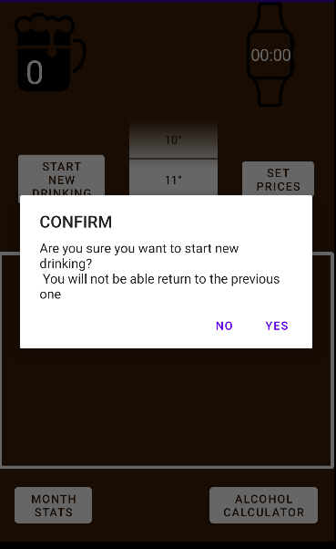
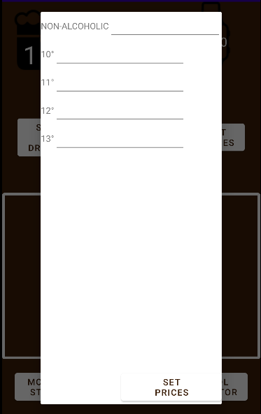

# User documentation for app Beer Manager

### Requirements

- Android 10 or higher

  

### Main view

​	Main view of the app consists of many elements that user can interact with and elements that provide info to the user. When the app is started it shows new empty drinking activity if more than 5 hours passed since the last added beer. Otherwise the last drinking activity is loaded.

### 1. Beer counter

​	Number of beers drank in current drinking session is displayed here. The number is increased by one after every correct line that user makes in part of screen (7) that displays user lines.

### 2. Full price

​	Icon of wallet with value is displayed only if user set price for at least one of the types of beer that he/she drank. The displayed value is sum of prices of all beers added for which the user set a price.

### 3. Watch

​	Displays time (hours and minutes) that has elapsed since the first beer was added.

### 4. Type of beer picker

​	User should choose here which type of beer he/she is currently drinking/ordering. When he/she draws the correct line chosen type of beer is added.

### 5. Start new drinking button

​	After clicking on this button dialog is shown. 

If user clicks on NO, app will return to the main view unchanged. If user clicks on YES, app will start new empty drinking activity and will return to main view where the new activity will be displayed. User is not able to return to the previous one. 

### 6. Set Prices button

​	After clicking on this button dialog is shown.

​																	 

​	User can fill prices for each type of the beer. Each value must be a real number that means only digits and decimal point is allowed. User has to click on the button SET PRICES at the bottom of the dialog to save the inserted prices.

### 7. Line canvas

​	User can draw lines for each beer drank/ordered in this part of the screen. If the drawn line is correct, one beer (of type that is chosen in the type of beer picker) is added and the line stays displayed. If the drawn line is incorrect, no beer is added and the line is not displayed.

​	The line has to be:

- At least as long as 1/3 of the canvas height
- At most as wide as 1/5 of the canvas width
- Drawn in one direction (top down or bottom up)

### 8. Alcohol calculator button

​	After clicking on this button dialog is shown.

​	If user wants to calculate his/her blood alcohol content, he/she must insert his/her weight as a real number, that means only digits and decimal point is allowed, and choose his/her sex. After clicking on the button CALCULATE text with information and graph is shown.

​	User can read when his/her blood alcohol content should be zero and his/her blood alcohol content for the period from drinking the last beer to zero blood alcohol content in the graph. The calculation (using the Widmark formula) is not accurate and can not be relied upon!

### 9. Month stats button

​	After clicking on this button dialog is shown.

​	User can see how many beers he/she recorded in the app for respective months.

